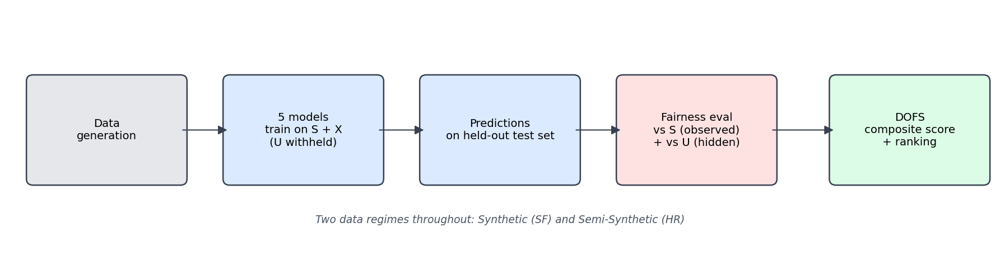

# Fairness Evaluation in the Presence of Unobserved Unfair Attributes

Seminar project for the course **"Applied Predictive Analytics"**, Faculty of Economics,
**Humboldt University of Berlin**.

This project benchmarks five predictors — **CFFair**, **CLAIRE**, **SRCVAE**, and **FairPFN**
(fairness-aware), alongside **XGBoost** (an unconstrained baseline with no fairness mechanism
of its own) — on two data regimes: purely synthetic scale-free causal-graph data (**SF**) and semi-synthetic
simulated hiring data (**HR**). Every model is evaluated on predictive performance and on
fairness with respect to both the **observed** protected attribute (S) and **hidden**
variables (U) that were deliberately withheld during training — the latter being the project's
core methodological contribution.

## Workflow overview



## Pipeline — sequence of events

The project runs in four stages, each depending on the output of the one before it:

1. **Data generation** (`Data_generation/`). The synthetic (SF) and semi-synthetic (HR)
   datasets are generated first, independently of any model. SF data comes from tunable
   scale-free causal graphs with configurable hidden-U ratios (`--u-ratios`; standard settings
   `0`, `0.5`, `1.0`, and `2.0`); hidden U nodes may act as confounders, mediators, or colliders.
   In the SF regime, `S0` is the observed binary protected attribute, `S1` is a hidden 3-class
   protected attribute, and `S2` is a hidden continuous protected attribute. The generated
   model-facing observed SF data contains `S0`, observed `X` variables, and `Y`; `S1`, `S2`, and
   hidden `U` variables are excluded from model inputs. HR data comes from a simulated
   hiring-decision process with labelled bias scenarios of varying severity and mechanism.

2. **Model-testing notebooks** (`Fairness_models/`). Each of the five models' reference
   implementations was adapted into its own notebook, restructured to fit this project's dataset
   schema (dynamic column discovery for `S`/`X`/`U` columns, consistent train/test splitting,
   consistent output schema). Running these notebooks produces the aggregate model result files
   and the prediction-detail files used for hidden-U fairness analysis.

3. **`Fairness_models/U_fairness_analysis.ipynb`**. Reads the per-sample prediction-detail files each
   model-testing notebook writes, clusters individuals by their hidden `U` values (k-means), and
   computes SPD / EOD / DIR with respect to those hidden-attribute clusters instead of the
   observed attribute `S`. Produces the `*_U_fairness.csv` files in `model_results/`.

4. **`model_benchmark.ipynb`**. The final analysis notebook. Loads everything in
   `model_results/`, computes the composite DOFS score, and produces every chart and table used
   in the results write-up.

## Running the benchmark notebook

The root `model_benchmark.ipynb` only needs the CSVs already present in `model_results/` — it
does **not** re-run any model. If hidden-U fairness needs to be recomputed, run
`Fairness_models/U_fairness_analysis.ipynb` first; it also does not re-run any model, but it
requires the prediction-detail CSVs described below. To reproduce the final benchmark analysis:

1. Confirm `model_results/` contains, for each of the five models, both a `*_syn_results.csv` /
   `*_semi_syn_results.csv` pair and a `*_syn_U_fairness.csv` / `*_semi_syn_U_fairness.csv` pair
   (10 + 10 = 20 files total).
2. Run `model_benchmark.ipynb` top to bottom.

**Note on prediction-detail files:** each model-testing notebook also writes a
`*_predictions_detail.csv` per model per regime (per-sample predictions, observed `S0`, `Y`,
and every `U` column — the raw material `Fairness_models/U_fairness_analysis.ipynb` clusters
on). These are **not included in this repository** due to their size (some exceed 5 million rows
/ several GB). If you need them — e.g. to re-run `Fairness_models/U_fairness_analysis.ipynb`
with a different clustering approach — regenerate them by re-running the relevant model-testing
notebook; they are written automatically alongside the aggregate results CSVs.

## Structure of each model-testing notebook

All five notebooks (`CFFair_testing.ipynb`, `CLAIRE_testing.ipynb`, `SRCVAE_testing.ipynb`,
`XGBoost_testing.ipynb`, `FairPFN_testing.ipynb`) follow the same layout:

1. **Imports and shared paths** — one cell, including the `save_predictions_detail()` helper
   used by every pipeline cell below.
2. **Model architecture / setup** — model-specific (e.g. CLAIRE's VAE + representation-learner
   classes, SRCVAE's adversarial debiasing classes, CFFair's abduction step, FairPFN's repo
   import and checkpoint loading, XGBoost's estimator).
3. **Synthetic (SF) pipeline** — a small **TRIAL** cell (1–2 files, for a quick sanity check)
   followed by the **full batch pipeline** (all SF datasets).
4. **Semi-Synthetic (HR) pipeline** — same TRIAL-then-full structure.

Each full pipeline cell, per dataset, withholds hidden variables from the model-facing inputs; in
the SF regime this means using `S0` and observed `X` features while keeping `S1`, `S2`, and `U`
out of the model inputs. The notebooks predict on a held-out test split and write two things:
one row of aggregate metrics to `{Model}_{regime}_results.csv`, and one row per test-set
individual (prediction, observed `S0`, `Y`, and every `U` column) to
`{Model}_{regime}_predictions_detail.csv`.

### Indicators generated

Per model, per dataset, the aggregate results CSVs report:

- **Metadata:** `n_S`, `n_X`, `n_U`, `total_samples`
- **Predictive metrics:** `ROC_AUC`, `Accuracy`, `Precision`, `Recall`, `F1_Score`
- **Fairness metrics (w.r.t. observed S):** `Statistical_Parity_Diff_(ATE)`,
  `Disparate_Impact_Ratio`, `Equal_Opportunity_Diff`, `Pos_Rate_S1`, `Pos_Rate_S0`

`Fairness_models/U_fairness_analysis.ipynb` adds the same three fairness metrics computed with respect to
hidden variables `U` (`Statistical_Parity_Diff_wrt_U`, `Disparate_Impact_Ratio_wrt_U`,
`Equal_Opportunity_Diff_wrt_U`). `model_benchmark.ipynb` then combines all of the above into the
composite **DOFS** (and its hidden-attribute counterpart, **DOFS_U**) score used for ranking.

## Environment and reproducibility

This project uses a conda environment (`fairpfn_env`, **Python 3.10.20**, Windows, CPU-only).

**To regenerate `requirements.txt` from the current environment:**

```bash
conda activate fairpfn_env
python --version          # should report Python 3.10.20
pip freeze > requirements.txt
```

`pip freeze` records the exact, currently-installed, working set of packages — the reliable
source of truth for reproducing this environment, rather than any of the earlier, partially
stale requirements files that accumulated during development.

> **Note:** on Windows, `pip freeze` occasionally emits lines like
> `package @ file:///D:/bld/...` for packages conda installed from a local build cache. These
> won't resolve on another machine. If you need a portable `requirements.txt` (e.g. to share this
> repo), strip the `@ file:///...` suffix from those lines and replace it with a plain
> `package==version` pin, or omit that package if it isn't essential to the analysis itself
> (most such lines are transitive OS-level dependencies, not packages the notebooks import
> directly).

## Runtime expectations

Full reproduction of every model-testing notebook, from scratch, on the reference CPU-only
Windows setup:

| Model | Approximate full-pipeline runtime |
|---|---|
| **FairPFN** | ~16 hours |
| CFFair | ~1–2 hours |
| CLAIRE | ~1–2 hours |
| SRCVAE | ~1–2 hours |
| XGBoost | ~1–2 hours |

FairPFN's runtime is dominated by its transformer architecture running zero-shot inference,
chunked to avoid out-of-memory errors on CPU. CLAIRE and SRCVAE train two neural networks per
dataset (a VAE plus a classifier); XGBoost and FairPFN otherwise do not require a training loop
in the traditional sense. Given these runtimes, always validate any change to a model-testing
notebook using its TRIAL cell (1–2 files) before committing to a full run.

## Other notes

- A partial copy of the FairPFN source code required for inference is included under
  `Fairness_models/FairPFN/`, while the pretrained checkpoint, `artifacts/fairpfn_config.pkl`,
  and other large pretrained/raw data artifacts are excluded via `.gitignore` due to file-size
  constraints. Within that copy, two source files required manual correction to run on this
  project's CPU-only Windows setup: `scripts/transformer_prediction_interface/base.py` (forces
  `device='cpu'`, `fp16_inference=False`) and
  `scripts/transformer_prediction_interface/configs.py` (replaces a hardcoded author-machine
  path with a local relative path). See the FairPFN notebook's imports cell for the corresponding
  `os.chdir` / `sys.path` setup this requires.
- **CFFair** is implemented as a deployable, abduction-based estimator (a linear regression of
  `X` on `S`, with the residual — not raw `S` or `X` — passed to the classifier), following
  Kusner et al. (2017)'s Level 3 method. It never has access to ground-truth `U` at any point.
- The composite **DOFS** metric follows the TOPSIS-inspired methodology of Velev and Lessmann
  (2026).
- `model_benchmark.ipynb` will not run correctly unless
  `Fairness_models/U_fairness_analysis.ipynb` has already produced the `*_U_fairness.csv` files
  — it loads that notebook's output CSVs and does not compute them itself.
